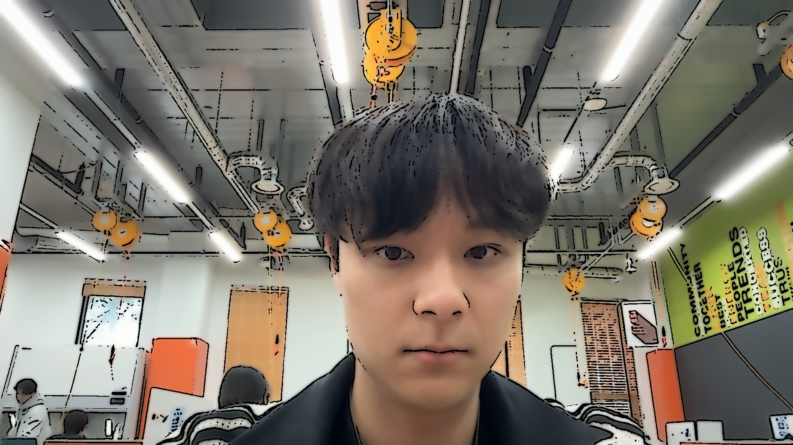
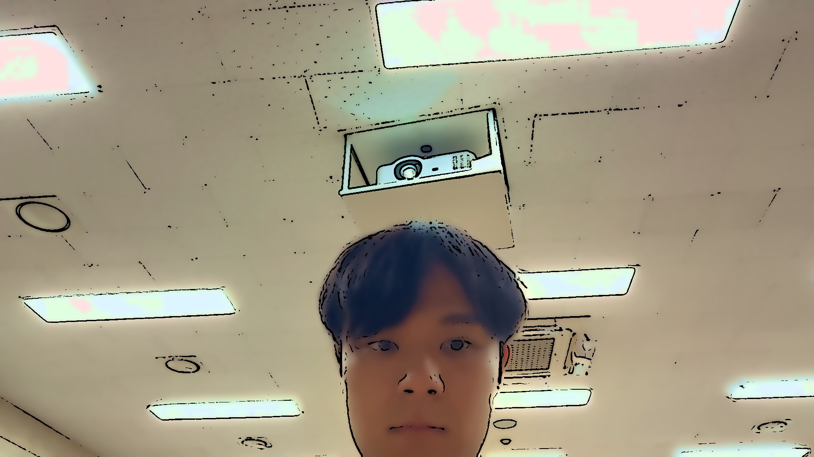

# Homework #2: Cartoon Rendering

본 프로젝트는 OpenCV를 활용하여 실시간 웹캠 영상을 만화 스타일(Cartoon Rendering)로 변환하고 사진으로 저장하는 프로그램입니다. 

초기 버전의 단순한 필터링 조합에서 시작하여, 지브리 애니메이션(Ghibli Style), 그리고 완전한 셀 애니메이션(Cell Animation) 스타일로 발전시키는 과정을 담고 있습니다. 각 버전별로 발생한 문제점을 분석하고, 이를 해결하기 위해 적용한 알고리즘과 파라미터 튜닝 과정을 상세히 기록하였습니다.

---

## 1. V1: 기본 카툰 렌더링 (Basic Cartoon Effect)

**목표:** OpenCV의 기본 필터들을 조합하여 사진에 만화 같은 질감과 스케치 윤곽선을 부여합니다.

### 사용된 핵심 기술
* **노이즈 제거:** `cv2.medianBlur` (커널 크기: 5)
* **윤곽선 추출:** `cv2.adaptiveThreshold` (`MEAN_C`, 블록 크기: 9, 보정 상수 C: 9)
* **색상 단순화:** `cv2.bilateralFilter` 반복 적용 (3회)

### 한계점 및 실패 원인 분석 (Limitation)
* **색상의 한계:** 원본 사진의 색감을 그대로 가져오기 때문에 현실의 칙칙한 그림자나 탁한 색상이 그대로 남아, 애니메이션 특유의 화사한 느낌이 부족했습니다.
* **과도한 엣지 검출:** 단순 주변 픽셀의 평균을 구하는 `MEAN_C` 방식을 사용하여 피부 모공, 벽지의 잔주름 등 불필요한 미세 질감까지 모두 굵은 검은 선으로 추출되어 이미지가 지저분해지는 문제가 발생했습니다.


*(경로명은 실제 저장된 이미지 파일명에 맞게 수정해주세요)*

---

## 2. V2: 지브리 스타일 렌더링 (Ghibli Style Effect)

**목표:** V1의 칙칙한 색감과 지저분한 선 문제를 해결하고, 지브리 애니메이션처럼 수채화 질감과 화사한 파스텔톤을 연출합니다.

### 문제 해결 및 개선 방법 (Problem Solving)
* **색감 부스팅 (HSV 공간 변환):** BGR 이미지를 HSV 공간으로 변환한 뒤, 채도(Saturation, +30)와 명도(Value, +15)를 강제로 끌어올려 애니메이션 특유의 맑고 화사한 색감을 연출했습니다.
* **수채화 질감 극대화:** `cv2.bilateralFilter`의 반복 횟수를 5회로 늘려 색상의 경계를 더욱 부드럽게 뭉갰습니다.
* **노이즈 억제 및 선 굵기 조절:** `cv2.medianBlur`의 커널 크기를 7로 키워 미세한 질감을 완전히 없앤 후, `cv2.adaptiveThreshold`의 보정 상수(C)를 5로 낮추어 선을 얇고 섬세하게 추출했습니다.

### 한계점 및 실패 원인 분석 (Limitation)
* **수채화 번짐의 한계:** Bilateral 필터를 여러 번 적용했음에도 여전히 미세한 그라데이션이 남아있어, 2D 만화책이나 짱구/도라에몽과 같은 완전한 '단색 블록(포스터 물감)' 느낌을 주지 못했습니다.



---

## 3. V3: 리얼 셀 애니메이션 (Cell Animation Effect)

**목표:** V2의 한계를 극복하고, 색상 경계가 뚜렷하고 그라데이션이 없는 '진짜 셀 애니메이션' 스타일을 구현합니다. 또한 얼굴 윤곽과 물체 테두리를 굵고 선명하게 구분합니다.

### 문제 해결 및 개선 방법 (Problem Solving)
* **K-Means 클러스터링 도입 (색상 양자화):** 수백만 개의 픽셀 색상을 K=14 개의 대표 색상으로 강제 병합(포스터라이징)하여, 그라데이션을 완전히 없애고 단색 물감으로 영역을 나누어 칠한 듯한 평면적인 느낌을 극대화했습니다.
* **해상도 축소/확대 (Image Pyramid):** K-Means 연산 전 이미지를 축소하고 연산 후 확대하는 과정을 통해, 픽셀이 부드럽게 보간(Interpolation)되며 파스텔이나 물감이 번진 듯한 자연스러운 텍스처를 유도했습니다.
* **윤곽선 필터링 강화 (`GAUSSIAN_C`):** * 흑백 이미지에 `cv2.bilateralFilter`를 선행 적용하여 진짜 테두리만 남기고 잔주름을 녹여 잡선을 억제했습니다.
    * `cv2.adaptiveThreshold`에 `GAUSSIAN_C`를 적용하고, 블록 크기(13)와 보정 상수(2)를 조절하여 얼굴 윤곽이나 물체의 테두리를 굵고 뚜렷하게 그려내도록 튜닝했습니다.


---

## 실행 방법 및 조작 키

### 환경 설정
본 프로그램은 Python 3 환경에서 OpenCV와 Numpy 라이브러리를 필요로 합니다.
```bash
pip install opencv-python numpy